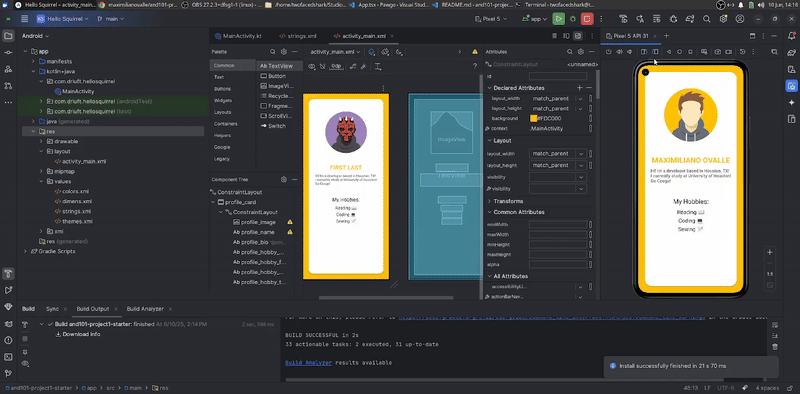

# AND101 Project 1 - Hello, Squirrel!

Submitted by: **Maximiliano Ovalle**

Time spent: **1** hour spent in total

## Summary

**Hello, Squirrel** is an android app that recreates the common "Hello, World!", to introduce ourselves to the neighborhood squirrel 🐿. This project was designed to help familiarize me with Android Studio and Kotlin!

If I had to describe this project in three (3) emojis, they would be: 🤓💻🔎

## Application Features

The following REQUIRED features are completed:

- [x] Change profile name to your name
- [x] Change profile bio text to a personal bio about yourself
- [x] Modify hobby section to include your top three (3) hobbies

The following STRETCH features are implemented:

- [x] Re-brand the app by modifying the UI
- [ ] Modify the profile image by uploading a new image drawable

## Video Demo

Here's a video / GIF that demos all of the app's implemented features:

GIF created with **your chosen GIF tool**

## Notes

I learned that most of what I edit is under very few of the files present in this app - mainly MainActivity, strings.xml, and activity_main.xml. There's no need to feel overwhelmed by all the directories and files present.

## License

Copyright **2025** **Maximiliano Ovalle**

Licensed under the Apache License, Version 2.0 (the "License");
you may not use this file except in compliance with the License.
You may obtain a copy of the License at

    http://www.apache.org/licenses/LICENSE-2.0

Unless required by applicable law or agreed to in writing, software
distributed under the License is distributed on an "AS IS" BASIS,
WITHOUT WARRANTIES OR CONDITIONS OF ANY KIND, either express or implied.
See the License for the specific language governing permissions and
limitations under the License.